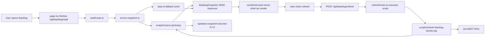

# Backlog Feature Technical Handoff

## Scope
This document explains how the `/backlog` feature works end-to-end, with emphasis on data retrieval, runtime behavior, and security boundaries.

## Key Files
- `/Users/yoramtap/Documents/AI/codex-loop/web/src/app/backlog/page.tsx`
- `/Users/yoramtap/Documents/AI/codex-loop/web/src/app/backlog/combined-team-trend-chart.tsx`
- `/Users/yoramtap/Documents/AI/codex-loop/web/src/app/backlog/types.ts`
- `/Users/yoramtap/Documents/AI/codex-loop/web/src/app/backlog/server-snapshot.ts`
- `/Users/yoramtap/Documents/AI/codex-loop/web/src/app/backlog/snapshot.json`
- `/Users/yoramtap/Documents/AI/codex-loop/web/src/app/backlog/data.ts` (fallback seed only)
- `/Users/yoramtap/Documents/AI/codex-loop/web/src/app/api/backlog/read/route.ts`
- `/Users/yoramtap/Documents/AI/codex-loop/web/src/app/api/backlog/refresh/route.ts`
- `/Users/yoramtap/Documents/AI/codex-loop/web/scripts/refresh-backlog-trends.mjs`
- `/Users/yoramtap/Documents/AI/codex-loop/web/package.json`
- `/Users/yoramtap/Documents/AI/codex-loop/web/next.config.ts`

## Architecture Overview
1. UI loads `/backlog` page.
2. Client requests `GET /api/backlog/read`.
3. Server reads `snapshot.json` (if present) via `server-snapshot.ts`.
4. Client renders combined chart (API + Legacy FE + React FE).
5. Refresh button triggers `POST /api/backlog/refresh`.
6. API route executes refresh script.
7. Script pulls Jira data and writes updated `snapshot.json`.
8. API returns updated snapshot; UI re-renders.

## Data Model
The client consumes `BacklogSnapshot` from `/src/app/backlog/types.ts`:
- `source.mode`
- `source.syncedAt`
- `source.note`
- `combinedPoints[]`
  - `date`
  - `api` priority buckets
  - `legacy` priority buckets
  - `react` priority buckets

Only aggregated trend counts are sent to the client.

## Jira Retrieval Logic
### Full refresh (all teams)
- Script: `/scripts/refresh-backlog-trends.mjs`
- Pulls data for:
  - API (`labels = API`)
  - Legacy FE (`labels = Frontend`)
  - React FE (`labels = NewFrontend`)
- Uses historical JQL (`status WAS NOT IN ... ON "date"`) per date point.
- Writes only `/src/app/backlog/snapshot.json`.

## Security Model
### What is server-only
- Jira credentials (`ATLASSIAN_EMAIL`, `ATLASSIAN_API_TOKEN`) are used only in server scripts.
- Jira calls happen from Node scripts, not from browser code.

### What is client-visible
- Aggregated snapshot data returned by API routes.
- No Jira token exposure in client bundle.

### Current protection state
- Refresh route has in-flight guard (prevents concurrent refresh execution).
- Refresh cooldown is enforced in UI after successful refresh.
- If publicly deployed, add auth/rate limits for `/api/backlog/refresh` (currently suitable for local/trusted usage).

## Local Operation
From `/Users/yoramtap/Documents/AI/codex-loop/web`:
- `npm run dev`
- `npm run backlog:refresh-trends` (full sync)

## Deployment Notes
- The interactive chart works for viewers as long as API routes are deployed and reachable.
- Static export-only hosting cannot run live refresh route logic.
- `next.config.ts` controls static export mode via `STATIC_EXPORT`.

## Troubleshooting
### Refresh button disables and seems stuck
- During active refresh: status shows `Refreshing Jira...`.
- After success: cooldown message shows unlock countdown.
- On failure: cooldown is cleared for immediate retry.

### Snapshot stale
- Run `npm run backlog:refresh-trends`.
- Confirm `snapshot.json` timestamp updates.

### Missing data for one team
- Run full refresh to update all three slices.
